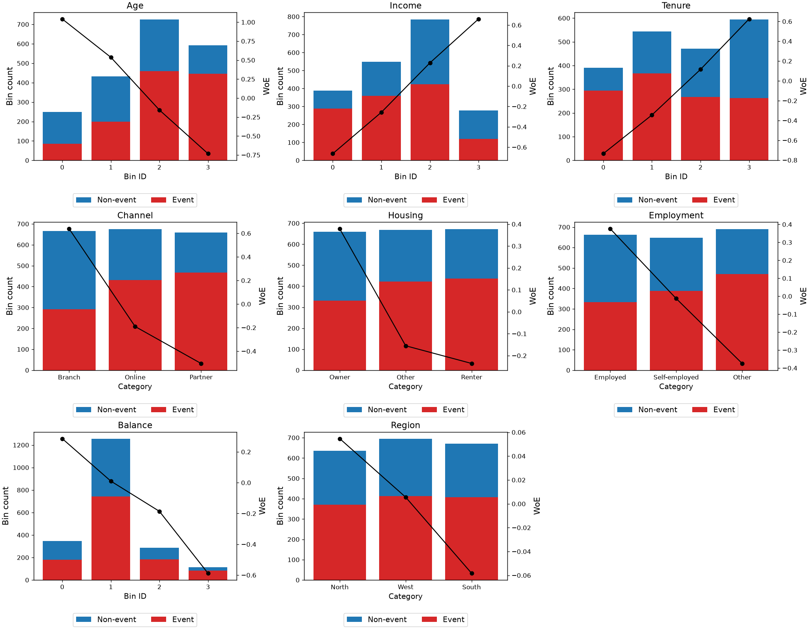

Binning process
===============

.. autoclass:: optbinning.BinningProcess
   :members:
   :inherited-members:
   :show-inheritance:

Plotting several variables
--------------------------

Plot selected variables using their existing binning-table charts::

    fig, axes = binning_process.plot(ncols=2)
    fig.savefig("binning_overview.png")

Choose a subset and its order with ``variable_names=["age", "income"]``.
The grid supports standard binary, continuous and multiclass binning tables,
uses their default metrics, and builds tables if needed. It returns a figure
and a two-dimensional array of primary axes without showing or closing them.
Unused panels are hidden. Piecewise and two-dimensional binning are outside
this interface.

To compose individual plots yourself, build a table and pass existing axes::

    fig, ax = plt.subplots()
    table = binning_process.get_binned_variable("age").binning_table
    table.build()
    table.plot(ax=ax)

Import ``matplotlib.pyplot as plt`` for the second example. The existing
standalone ``table.plot()`` behavior is unchanged.

Example: numerical and categorical features
~~~~~~~~~~~~~~~~~~~~~~~~~~~~~~~~~~~~~~~~~~~

This synthetic example plots four continuous-valued numerical features and
four categorical features in a three-column grid. The target is binary.
Declare categorical columns explicitly with ``categorical_variables``.

.. code-block:: python

    import matplotlib.pyplot as plt
    import numpy as np
    import pandas as pd
    from optbinning import BinningProcess

    rng = np.random.default_rng(315)
    n = 2000
    age = rng.uniform(18, 75, n)
    income = rng.lognormal(10.8, 0.5, n)
    tenure = rng.uniform(0, 15, n)
    balance = rng.lognormal(8, 0.8, n)
    region = rng.choice(['North', 'South', 'West'], n)
    channel = rng.choice(['Branch', 'Online', 'Partner'], n)
    housing = rng.choice(['Owner', 'Renter', 'Other'], n)
    employment = rng.choice(['Employed', 'Self-employed', 'Other'], n)
    channel_effect = pd.Series(channel).map(
        {'Branch': -0.8, 'Online': 0.2, 'Partner': 1.0}).to_numpy()
    housing_effect = pd.Series(housing).map(
        {'Owner': -0.5, 'Renter': 0.4, 'Other': 0.1}).to_numpy()
    employment_effect = pd.Series(employment).map(
        {'Employed': -0.4, 'Self-employed': 0.2, 'Other': 0.7}).to_numpy()
    logit = ((age - 45) / 20 - (np.log(income) - 10.8)
             - (tenure - 7.5) / 8 + channel_effect
             + housing_effect + employment_effect
             + (np.log(balance) - 8) / 2 + 0.4 * (region == 'South'))
    y = rng.binomial(1, 1 / (1 + np.exp(-logit)))
    X = pd.DataFrame({
        'Age': age, 'Income': income, 'Tenure': tenure,
        'Channel': channel, 'Housing': housing, 'Employment': employment,
        'Balance': balance, 'Region': region})
    categorical = ['Channel', 'Housing', 'Employment', 'Region']
    process = BinningProcess(
        variable_names=list(X.columns), categorical_variables=categorical,
        max_n_bins=4)
    process.fit(X, y)
    fig, axes = process.plot(
        ncols=3, figsize=(18, 14), add_special=False, add_missing=False)
    # Customize categorical labels through the returned axes.
    for ax, name in zip(axes.flat, X.columns):
        if name not in categorical:
            continue
        groups = process.get_binned_variable(name).splits
        ax.set_xticks(
            np.arange(len(groups)), [', '.join(map(str, group)) for group in groups])
        ax.set_xlabel('Category')
    fig.savefig('binning_mixed_features.png', dpi=120)
    plt.close(fig)

   Eight features fill two complete rows and two panels in the last row.
   The unused ninth panel is hidden automatically. Numerical features use
   bin IDs; categorical features use names set through the returned axes.
   Stacked bars show event/non-event counts; black curves show WoE on
   each panel's right axis. Special and missing bins are hidden because this
   synthetic dataset contains neither.

No feature-selection criteria are configured here, so ``plot()`` includes
all eight fitted variables. To include all fitted variables even when selection
criteria are configured, pass ``variable_names=process.variable_names``.
For an interactive display, replace ``plt.close(fig)`` with ``plt.show()``.
